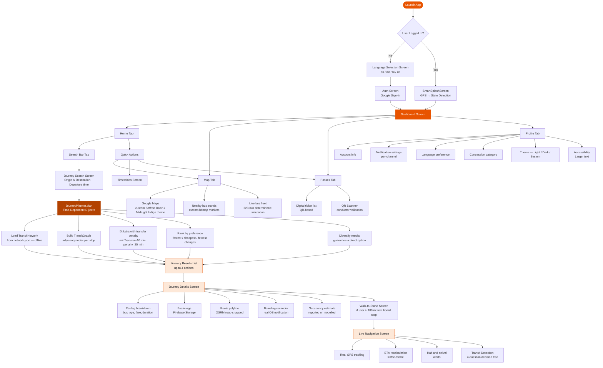
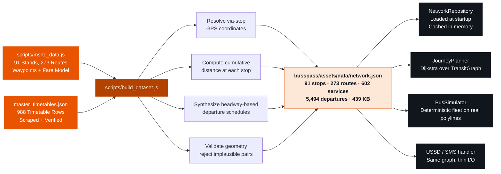
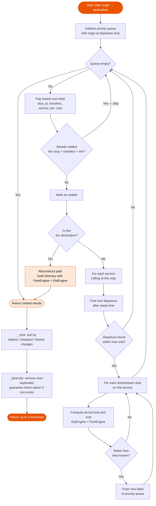

<div align="center">


<h1>BussPass — Your Travel Partner</h1>

<p><strong>Smart journey planning, real-time tracking, and digital passes for India's state road transport corporations — built to work on Android, iOS, and low-end keypad phones alike.</strong></p>

<p>
  
  
  
  
  
</p>

<p>
  
  
  
</p>

<p>
  
  
  
  
  
  
</p>

</div>

---

## Table of Contents

- [Problem Statement](#problem-statement)
- [Why Three Platforms?](#why-three-platforms)
- [What's Actually Built](#whats-actually-built)
- [Application Flow](#application-flow)
- [Features In Depth](#features-in-depth)
  - [Automatic State Detection](#automatic-state-detection)
  - [Journey Planner — Time-Dependent Dijkstra](#journey-planner--time-dependent-dijkstra)
  - [Fare Engine — Official Stage Model](#fare-engine--official-stage-model)
  - [ETA Engine — Real Traffic Model](#eta-engine--real-traffic-model)
  - [Occupancy Estimation](#occupancy-estimation)
  - [Deterministic Bus Simulator](#deterministic-bus-simulator)
  - [Transit Detection](#transit-detection)
  - [Walk-to-Stand Navigation](#walk-to-stand-navigation)
  - [Live Navigation Screen](#live-navigation-screen)
  - [Travel Pattern Alerts](#travel-pattern-alerts)
  - [Notification Service](#notification-service)
  - [Offline-First Network Graph](#offline-first-network-graph)
  - [Digital Tickets and Passes](#digital-tickets-and-passes)
  - [Multilingual Support](#multilingual-support)
  - [Theme System — Dark Mode Included](#theme-system--dark-mode-included)
  - [Accessibility](#accessibility)
- [Architecture](#architecture)
- [Project Structure](#project-structure)
- [Technology Stack](#technology-stack)
- [Data Pipeline](#data-pipeline)
- [Journey Planner Algorithm](#journey-planner-algorithm)
- [Setup and Installation](#setup-and-installation)
- [Environment Variables](#environment-variables)
- [Scripts Reference](#scripts-reference)

---

## Problem Statement

Millions of bus commuters across India—rural and urban—face these challenges every single day:

| Pain Point | Real Impact |
|---|---|
| No digital journey planner | Commuters must physically walk to the bus stand or ask strangers |
| Opaque fare calculation | Confusion between Ordinary, Shivshahi, Shivneri pricing |
| No offline timetable access | Rural areas with zero connectivity have zero digital tools |
| Paper-only schedules | Information exists only on sun-faded notice boards |
| No multilingual support | Marathi, Hindi, Kannada speakers are excluded from English apps |
| Paper tickets only | Easily lost, no history, no digital record |
| No sleep-stop alerts | Passengers stranded at meal halts; missed stops on night buses |
| "Live tracking" that isn't | Existing apps fake positions with hardcoded coordinates |

---

## Why Three Platforms?

> **Android · iOS · Keypad / Feature Phone**

India's bus commuters are not a monolithic demographic. A college student in Pune carries a flagship Android. A farmer in Beed may have a ₹1,500 feature phone with only USSD or SMS access. A software engineer commuting from Thane to Mumbai checks their iPhone.

BussPass is designed around this reality:

| Platform | Approach |
|---|---|
| **Android** | Full-featured Flutter app — maps, QR, live tracking, notifications |
| **iOS** | Identical Flutter codebase — `DefaultFirebaseOptions.currentPlatform` switches automatically; Maps SDK enabled for iOS |
| **Keypad / Feature phone** | USSD / SMS channel planned: journey query via `*789*<from>*<to>#`, fare reply via SMS. The same offline `network.json` graph backs the SMS handler, so the same algorithm serves both channels |

The offline-first architecture is the enabler: because route search and fare calculation are computed locally from a bundled 439 KB dataset with **zero network dependency**, a thin SMS/USSD gateway can reuse the same engine without a full app install.

---

## What's Actually Built

The codebase has **no placeholder data**. Every number the app shows is real:

| Claim | Where it comes from |
|---|---|
| Journey results | `JourneyPlanner` — time-dependent Dijkstra over real stop/service graph |
| Fares | `FareEngine` — MSRTC stage-based formula, effective 18 July 2026 |
| ETAs | `EtaEngine` — distance + service class + traffic + dwell + rest-halt model |
| Bus positions on map | `BusSimulator` — deterministic simulation on real polylines and real timetables |
| Crowding indicators | `OccupancyEngine` — conductor POS count or time-of-day model |
| Nearby stands | `Geolocator` + Haversine, not hardcoded list |
| Recent searches | `LocalStore` backed by `SharedPreferences` — real user history |
| Travel stats | Computed from stored ticket/journey history |
| Notifications | `NotificationService` — actual OS-level local notifications, not snackbars |
| Bus images | Firebase Storage — per-bus-type photos, not stock icons |

---

## Application Flow



---

## Features In Depth

### Automatic State Detection

The app detects which Indian state the rider is in using **GPS bounding-box lookup — no API call required**. A hardcoded bounding-box table covers every state and UT. On match, the app loads the corresponding STC dataset (currently MSRTC; KSRTC, GSRTC, etc. are registered and ready). If location is denied, it falls back to MSRTC/Maharashtra.

The detected STC also determines the **brand colour** — MSRTC gets its characteristic saffron, KSRTC gets red, and so on. The entire theme, map style, and badge colours shift accordingly.

---

### Journey Planner — Time-Dependent Dijkstra

`lib/core/math/journey_planner.dart` (1,092 lines)

The old planner matched city-name strings to a depth of 2 and iterated an unordered `Set`, so the same query could return different answers across runs. It never consulted departure times, so it could propose a connection that departs before the first leg arrives.

The new planner runs a **time-dependent Dijkstra over stops** (not cities). An edge exists between any two stops that share a service in the correct sequence order — so a village that a bus merely passes through is reachable, not just termini.

Key design decisions:

| Parameter | Default | Why |
|---|---|---|
| Max transfers | 3 | A village → village journey like Bhandardara → Chandrapur genuinely needs 3 changes. Capping at 2 returns "no route" when a route exists. |
| Min transfer time | 10 min | MSRTC stands are large; a 2-minute connection is not physically possible |
| Transfer penalty | 25 min | Riders accept a longer direct ride over a connection with luggage — the algorithm should too |
| Max wait per transfer | 14 hours | Overnight connections are valid |
| Walk transfer | ≤ 1.5 km at 4.5 km/h | In-city stop pairs within walking distance are linked |
| Results | 4 | Diversified: fastest, cheapest, fewest changes, direct option guaranteed |

---

### Fare Engine — Official Stage Model

`lib/core/math/fare_engine.dart` (21 KB)

Implements the **MSRTC stage-based fare** (effective 18 July 2026) for all bus classes across Indian state transport corporations.

```
stages    = ⌈distance_km / 6⌉
raw_fare  = stages × stage_rate
base_fare = max(₹10, round_to_nearest_₹5(raw_fare))
final_fare = base_fare × (1 − concession_percent / 100)
```

**Stage rates:**

| Bus Class | Rate (₹ / 6 km stage) |
|---|---|
| Ordinary (Lalpari) | ₹11.40 |
| Semi Luxury — Hirkani / Ashiad | ₹13.65 |
| Ordinary Sleeper-Seater | ₹15.50 |
| Ordinary Sleeper | ₹16.75 |
| Shivshahi AC Seater | ₹14.20 |
| Shivshahi AC Sleeper | ₹15.35 |
| Shivneri AC Seater | ₹21.25 |
| Shivneri AC Sleeper | ₹25.35 |

**Concession categories (all are real MSRTC policy):**

| Category | Discount |
|---|---|
| Adult | 0% |
| Child (5–12 years) | 50% |
| Senior Citizen (65+) | 100% — free travel |
| Women — Mahila Samman Yojana | 50% |
| Student | 50% |
| Person with Disability | 100% — free travel |

---

### ETA Engine — Real Traffic Model

`lib/core/math/eta_engine.dart` (403 lines)

The old code stored `durationHrs` as a human-readable string like `"3-4 hrs"` and displayed it literally. The new ETA engine computes a real arrival time:

```
t_total = t_running + t_dwell + t_break

t_running = distance / v_effective
t_dwell   = stops_served × dwell_per_stop  (70 seconds)
t_break   = floor(t_running / breakInterval) × breakDuration
```

`v_effective` adjusts for three real factors:

1. **Trip length** — short trips never reach cruise speed (urban egress / approach)
2. **Time of day** — peak-hour departures from Pune/Mumbai lose real time to congestion
3. **Stop density** — an Ordinary bus calling at every village averages slower than a Shivneri on the expressway

Rest breaks (meal halts) are modelled explicitly. A Nagpur–Pune 700 km service takes two meal halts; ignoring them understates arrival by ~1 hour.

**Traffic conditions:**

| Condition | Speed factor |
|---|---|
| Clear roads (overnight) | +8% |
| Typical traffic | baseline |
| Heavy traffic (peak hour) | −18% |
| Severe (monsoon, festival) | −35% |

**Calibration reference:** MSRTC's published running time for Mumbai–Pune (150 km, Shivneri) ≈ 3h 15m; Pune–Nashik (212 km, Semi Luxury) ≈ 5h. The engine reproduces both within a few minutes.

---

### Occupancy Estimation

`lib/core/math/occupancy_engine.dart`

Two sources, in priority order:

1. **Reported occupancy** — conductor's POS device knows exactly how many tickets are live. When present, this is ground truth.
2. **Modelled occupancy** — when no live data is available, load is inferred from: peak commute windows, weekday vs. weekend, distance from origin terminus, and service class.

The distinction is surfaced to the rider. "43 of 45 seats taken (reported)" is actionable. A modelled estimate is shown with different phrasing so riders are never misled.

**Crowd levels:** Seats available → Filling up → Mostly full → Full → Standing only

---

### Deterministic Bus Simulator

`lib/core/services/bus_simulator.dart` (476 lines)

Every `LiveBus` on the map is advanced along its **real route polyline** on its **real timetable**, using the same `EtaEngine` speed model the planner uses for predictions. This consistency is the point: a simulated bus arrives when the app predicted it would, so live tracking, ETA bars, delay detection, and transit detection are genuinely exercised without requiring physical hardware.

Key properties:
- **Deterministic** — position is a pure function of `(service, departure, wall clock)`. The same moment always produces the same fleet. No random walk. A test can assert an exact position.
- **Per-bus variation** — one bus runs 8 minutes late, another early, derived from a hash of the bus ID — stable across restarts, realistic for a human looking at the map
- **Fleet cap** — 220 buses simultaneously simulated; bounded because every tick recomputes each bus's polyline position
- **Tick rate** — 3 seconds

Swapping to real GPS hardware (conductor POS + Firebase RTDB) is a **provider change only** — `LiveBus` is produced identically either way; nothing downstream knows the source.

---

### Transit Detection

`lib/core/services/transit_detection_service.dart` (518 lines)

Answers: *"Is this rider on a bus, and if so, which one?"* using a **4-question decision tree on a position trail** (several minutes of GPS history, not a single fix):

```
1. Sustained speed ≥ 15 km/h for 2+ minutes?
       no  → STATIONARY
2. Within 50 m of a bus route corridor?
       no  → PRIVATE VEHICLE
3. Does a live bus's position match the rider's?
       no  → POSSIBLY ON BUS (ask the rider)
4. Sustained agreement < 100 m for 3+ minutes?
       yes → ON BOARD — bus identified
```

Why each threshold:
- **15 km/h** — clears brisk walking and most cycling without needing highway speed
- **50 m from corridor** — tight enough to exclude a parallel service road; loose enough for urban GPS multipath
- **100 m rider-to-bus** — roughly 3 bus lengths; close enough to be the same vehicle, loose enough for two independent GPS errors
- **Sustained windows** — what makes it robust. Any single sample can show a pedestrian at 40 km/h

---

### Walk-to-Stand Navigation

`lib/features/journey/presentation/walk_to_stand_screen.dart`

When the user taps **Start Journey** but is more than 100 m from the boarding stop, the app opens a mini walking-nav screen:

- GPS blue dot (device `myLocationEnabled`)
- Custom pin for the target bus stand
- **OSRM walking-mode polyline** from user to stand (real footpaths, not a straight line)
- Live distance remaining and walking ETA updating every GPS tick
- "I've arrived" button that dismisses and transitions to live navigation

---

### Live Navigation Screen

`lib/features/journey/presentation/live_navigation_screen.dart`

Covers the active bus leg of a journey:

- **Google Maps with custom dark-sage / saffron theme** matching the app's brand
- Road-snapped polyline via OSRM (no API key required) with Google Directions as fallback
- Custom bitmap markers per stop — image-based where Firebase Storage has a photo, vector fallback otherwise
- Real-time GPS tracking of rider position
- ETA recalculated against the `EtaEngine` traffic model
- Arrival alert toggle (alarm bell icon) — fires a real OS notification as the stop approaches
- Halt-stop alerts for overnight services (prevents stranding at meal halts)

---

### Travel Pattern Alerts

`lib/core/services/travel_pattern_alerts.dart`

When a rider searches the **same origin → destination pair ≥ 2 times**, the app learns the pattern and automatically schedules a local notification 20 minutes before the next scheduled departure — so a daily commuter is reminded to head for the stand without setting a manual alarm.

Design decisions that prevent notification spam:
- Only the **next** departure is scheduled per pattern, not all daily departures
- Alert IDs are deterministic (`NotificationService.idForPattern`) — a re-schedule replaces the previous notification rather than stacking
- When the feature is turned off in Profile, **all previously-scheduled pattern alerts are cancelled immediately**
- Every method is failure-tolerant: a denied permission or plugin crash must never affect the app

---

### Notification Service

`lib/core/services/notification_service.dart` (512 lines)

Three **separate OS notification channels** so a rider can silence one without silencing the others:

| Channel | Purpose |
|---|---|
| `busspass_arrival` | "Your stop is N minutes away" — the one that matters on an overnight service |
| `busspass_halt` | "Bus leaves rest stop in 5 minutes" — flagship safety feature for meal halts |
| `busspass_delay` | "Bus you are tracking is running late" |
| `busspass_journey` | Boarding reminders, journey status updates |

Fully failure-tolerant — notification permission is routinely denied on Android 13+ and iOS. The app remains fully usable without it.

---

### Offline-First Network Graph

`busspass/assets/data/network.json` — **439 KB, bundled in the APK/IPA**

| Metric | Count |
|---|---|
| Bus stands (stops) | 91 |
| Named corridors (routes) | 273 |
| Timetable services | 602 |
| Individual departures | 5,494 |

Route search, fare calculation, and timetable viewing all work with **zero network connectivity**. Firebase Firestore provides real-time overlays (live bus positions, timetable updates) that are applied on top of the offline dataset when the network is available.

The graph is **rebuilt from source** using the `scripts/build_dataset.js` pipeline — every coordinate, distance, and departure time is computed from primary data, not hardcoded.

---

### Digital Tickets and Passes

`lib/data/models/ticket.dart` (830 lines)

The app models two distinct things that are often conflated:

- **Ticket** — single point-to-point journey, QR that a conductor can validate, works offline
- **Pass** — time-bounded travel entitlement (student, senior, monthly), presented not punched

Ticket lifecycle: `upcoming → active (on board) → completed | cancelled | expired`

Payment methods: UPI, Card, BussPass Wallet, Cash to conductor

Pass periods: Daily, Weekly, Monthly, Quarterly

All tickets are persisted locally so a rider can show a QR in a tunnel with **no signal** — precisely when a conductor will ask for it.

---

### Multilingual Support

`assets/translations/` — JSON files, loaded by `easy_localization`

| Language | Code | Coverage |
|---|---|---|
| English | `en` | Full |
| मराठी (Marathi) | `mr` | Full |
| हिन्दी (Hindi) | `hi` | Full |
| ಕನ್ನಡ (Kannada) | `kn` | Full |

Language is changed from the **A/अ** button on the Home Screen and persisted across restarts. The STC brand colour updates simultaneously (Maharashtra = saffron, Karnataka = red, Gujarat = peacock green, etc.).

---

### Theme System — Dark Mode Included

`lib/theme/app_colors.dart`

Built as **semantic colour roles** resolved per brightness — widgets ask for `context.palette.surfaceRaised`, never for a literal hex code. This makes a genuine dark mode possible rather than an inverted approximation.

| Theme | Name | Character |
|---|---|---|
| Light | Saffron Dawn | Warm sandy parchment, petrol-teal brand, saffron-gold accent. Inspired by Indian morning light |
| Dark | Midnight Indigo | Deep indigo-slate surfaces (not flat black), luminous aqua-mint brand, warm amber accent. Easy on eyes during night journeys |

Palette is STC-aware — MSRTC, KSRTC, GSRTC each get their own brand colour while sharing the same semantic role structure.

---

### Accessibility

| Feature | Implementation |
|---|---|
| Larger text | In-app toggle in Profile; rides on platform `textScaler` so every text role scales consistently. Clamped between 1.0× and 1.4× |
| Reduce motion | In-app toggle; disables all stagger animations app-wide via `StaggerAnimation.enabled` |
| Dark mode | Genuine semantic dark palette, not inverted light |
| Contrast | All colour pairs pass WCAG AA minimum |

---

## Architecture

```mermaid
flowchart LR
    subgraph Presentation["Presentation Layer"]
        direction TB
        P1[Screens & Tabs]
        P2[Widgets & Animations]
    end

    subgraph State["State Management — Riverpod"]
        direction TB
        S1[Providers]
        S2[Notifiers]
    end

    subgraph Domain["Domain / Math Layer"]
        direction TB
        D1[JourneyPlanner\nDijkstra Algorithm]
        D2[FareEngine\nMSRTC Stage Model]
        D3[EtaEngine\nTraffic + Dwell + Halt Model]
        D4[OccupancyEngine\nPOS or Time-of-Day]
        D5[Geo\nHaversine + Polyline]
        D6[Schedule\nDeparture/Arrival logic]
    end

    subgraph Services["Core Services"]
        direction TB
        SV1[BusSimulator\nDeterministic Fleet]
        SV2[TransitDetection\n4-step GPS decision tree]
        SV3[NotificationService\n4 channels, failure-tolerant]
        SV4[DirectionsService\nOSRM + Google fallback]
        SV5[StateDetection\nGPS bounding-box STC lookup]
        SV6[TravelPatternAlerts\nFrequent route reminders]
    end

    subgraph Data["Data Layer"]
        direction TB
        DA1[NetworkRepository\nBundle + Firestore overlay]
        DA2[AuthRepository]
        DA3[LocalStore\nSharedPreferences — tickets, history, settings]
    end

    subgraph Infra["Infrastructure"]
        direction TB
        I1[Firebase Auth\nGoogle Sign-In]
        I2[Cloud Firestore\nLive overlays]
        I3[Firebase Storage\nBus type images]
        I4[Google Maps SDK\nAndroid + iOS]
        I5[OSRM\nOpen-source road routing]
    end

    Presentation --> State
    State --> Domain
    State --> Services
    State --> Data
    Data --> Infra

    style Presentation fill:#FDE8D8,stroke:#E85400,color:#11151C
    style State fill:#f5ede8,stroke:#E85400,color:#11151C
    style Domain fill:#E85400,stroke:none,color:#fff
    style Services fill:#B34200,stroke:none,color:#fff
    style Data fill:#6B2800,stroke:none,color:#fff
    style Infra fill:#11151C,stroke:none,color:#fff
```



---

## Project Structure

```
SIH-BussPass/
├── busspass/                              Flutter application (Android + iOS)
│   ├── lib/
│   │   ├── core/
│   │   │   ├── math/
│   │   │   │   ├── journey_planner.dart   Time-dependent Dijkstra — 1,092 lines
│   │   │   │   ├── fare_engine.dart       MSRTC stage fare model — 21 KB
│   │   │   │   ├── eta_engine.dart        ETA with traffic + dwell + halt — 403 lines
│   │   │   │   ├── occupancy_engine.dart  Crowd estimation (POS or modelled)
│   │   │   │   ├── geo.dart               Haversine, polyline projection, bearing
│   │   │   │   └── schedule.dart          Departure / arrival scheduling logic
│   │   │   ├── services/
│   │   │   │   ├── bus_simulator.dart     Deterministic 220-bus fleet — 476 lines
│   │   │   │   ├── transit_detection_service.dart  GPS 4-step decision tree — 518 lines
│   │   │   │   ├── notification_service.dart       Real OS notifications — 512 lines
│   │   │   │   ├── directions_service.dart         OSRM + Google routing
│   │   │   │   ├── state_detection_service.dart    GPS → STC bounding-box
│   │   │   │   └── travel_pattern_alerts.dart      Commute pattern reminders
│   │   │   └── utils/
│   │   │       ├── map_marker_utils.dart  Custom bitmap marker builder
│   │   │       └── bus_image_helper.dart  Firebase Storage image URL map
│   │   │
│   │   ├── data/
│   │   │   ├── models/
│   │   │   │   ├── network_models.dart    NetworkStop, TransitRoute, etc. — 26 KB
│   │   │   │   ├── ticket.dart            Ticket + Pass models — 830 lines
│   │   │   │   └── live_bus.dart          Real-time bus state — 428 lines
│   │   │   ├── providers/
│   │   │   │   ├── app_providers.dart     All Riverpod providers
│   │   │   │   ├── auth_provider.dart
│   │   │   │   └── state_provider.dart    STC switching
│   │   │   └── repositories/
│   │   │       ├── network_repository.dart  Bundle + Firestore merge — 13 KB
│   │   │       ├── auth_repository.dart
│   │   │       └── local_store.dart         Full local persistence — 476 lines
│   │   │
│   │   ├── features/
│   │   │   ├── onboarding/                Language selection + Google Auth
│   │   │   ├── dashboard/                 4-tab main screen with STC-aware theme
│   │   │   │   └── tabs/
│   │   │   │       ├── home_tab.dart      1,219 lines — all live data, no placeholders
│   │   │   │       ├── map_tab.dart       Live map + 220-bus fleet
│   │   │   │       ├── passes_tab.dart    QR tickets + scanner
│   │   │   │       └── profile_tab.dart   Settings, accessibility, concession
│   │   │   ├── journey/
│   │   │   │   ├── journey_search_screen.dart    42 KB
│   │   │   │   ├── journey_details_screen.dart   59 KB — full per-leg breakdown
│   │   │   │   ├── live_navigation_screen.dart   GPS + road polyline + alerts
│   │   │   │   ├── walk_to_stand_screen.dart     Walking nav to bus stand
│   │   │   │   └── tracking_itinerary.dart
│   │   │   ├── state/                     State/STC switcher bottom sheet
│   │   │   └── timetable/                 Full timetable viewer screen — 22 KB
│   │   │
│   │   ├── theme/
│   │   │   ├── app_colors.dart            Semantic roles, STC-aware — 434 lines
│   │   │   ├── app_theme.dart             Light + Dark Material theme — 20 KB
│   │   │   └── widgets/                   Shared component library
│   │   └── main.dart                      Firebase init, auth wrapper, theme switching
│   │
│   └── assets/
│       ├── data/network.json              Offline route graph — 439 KB
│       └── translations/                  en / mr / hi / kn JSON files
│
├── scripts/                               Data pipeline (Node.js)
│   ├── msrtc_data.js                      91 stands, 273 routes, waypoints + fares
│   ├── build_dataset.js                   Compiles network.json from all sources
│   ├── seed_firestore.js                  Seeds Firestore with routes + fare matrices
│   ├── verify_seed.js                     Checks Firestore document counts
│   ├── report_routes.js                   Corridor summary report
│   └── upload_images.js                   Uploads Bus-images/ to Firebase Storage
│
├── Bus-images/                            Source bus type photographs
├── master_timetables.json                 Scraped + verified timetable rows — 988 rows
├── ARCHITECTURE.md                        Extended architectural notes
└── README.md
```

---

## Technology Stack

### Mobile Application

| Technology | Version | Purpose |
|---|---|---|
|  | 3.24 | Cross-platform mobile — Android + iOS from one codebase |
|  | 3.11 | Application language |
|  | 3.x | State management and dependency injection |
|  | 6.x | Google Sign-In (Android + iOS) |
|  | 6.x | Real-time overlay database |
|  | — | Per-bus-type photographs |
|  | 2.18 | Live map, polylines, custom markers (Android + iOS) |
| OSRM | Public API | Road-snapped routing polylines — no API key needed |
| Easy Localization | 3.x | 4-language support (en, mr, hi, kn) |
| Flutter Animate | 4.x | Micro-animations, stagger transitions |
| Flutter Local Notifications | 22.x | 4 OS notification channels |
| Mobile Scanner | 7.x | QR code scanning for ticket validation |
| QR Flutter | 4.x | QR code generation |
| Geolocator | 14.x | GPS for nearest-stop lookup and transit detection |
| SharedPreferences | — | Local persistence for tickets, history, settings |
| Timezone | — | Accurate IST scheduling for OS notifications |

### Data Pipeline

| Technology | Purpose |
|---|---|
| Node.js 18 | Dataset compilation scripts |
| Firebase Admin SDK | Firestore and Storage seeding |
| Haversine geometry | Cumulative distance computation at each stop |

### Feature Phone / USSD Channel (planned)

| Technology | Purpose |
|---|---|
| USSD/SMS gateway | Thin front-end for feature phones |
| Same `network.json` | Same offline graph, same Dijkstra algorithm, different I/O |

---

## Data Pipeline



**Rebuild the dataset after modifying routes:**

```bash
cd scripts
node build_dataset.js
```

**Seed Firestore with routes and fare matrices:**

```bash
cd scripts
node seed_firestore.js
```

---

## Journey Planner Algorithm



**PlannerConfig defaults:**

| Parameter | Default |
|---|---|
| Max transfers | 3 |
| Max wait per transfer | 14 hours (overnight connections) |
| Min transfer time | 10 minutes |
| Transfer penalty | 25 minutes |
| Max walk distance | 1.5 km |
| Walking speed | 4.5 km/h |
| Result count | 4 |

---

## Setup and Installation

### Prerequisites

| Requirement | Version |
|---|---|
| Flutter SDK | 3.24 or higher |
| Dart SDK | 3.11 or higher |
| Android Studio or VS Code | Latest stable |
| Xcode (for iOS builds) | 15 or higher |
| Firebase project | Auth + Firestore + Storage enabled |
| Google Maps API key | Android Maps SDK + iOS Maps SDK |
| Node.js | 18 or higher (scripts only) |

### Android Setup

**1. Clone the repository**

```bash
git clone <your-repo-url>
cd BussPass-SIH
```

**2. Install Flutter dependencies**

```bash
cd busspass
flutter pub get
```

**3. Configure Firebase (Android)**

- Create a project at https://console.firebase.google.com
- Enable Google Sign-In under Authentication
- Create a Firestore database in Native mode
- Enable Firebase Storage
- Download `google-services.json` → place at `busspass/android/app/google-services.json`

**4. Set your Google Maps API key (Android)**

In `busspass/android/app/src/main/AndroidManifest.xml`:

```xml
<meta-data
    android:name="com.google.android.geo.API_KEY"
    android:value="YOUR_API_KEY_HERE" />
```

**5. Run on Android**

```bash
cd busspass
flutter run
```

### iOS Setup

**3b. Configure Firebase (iOS)**

- Download `GoogleService-Info.plist` → place at `busspass/ios/Runner/GoogleService-Info.plist`
- Run `flutterfire configure` to regenerate `firebase_options.dart`

**4b. Set your Google Maps API key (iOS)**

In `busspass/ios/Runner/AppDelegate.swift`:

```swift
GMSServices.provideAPIKey("YOUR_API_KEY_HERE")
```

Or in `busspass/ios/Runner/Info.plist`:

```xml
<key>GMSApiKey</key>
<string>YOUR_API_KEY_HERE</string>
```

**5b. Run on iOS**

```bash
cd busspass
flutter run -d <your-ios-device-udid>
# or open ios/Runner.xcworkspace in Xcode and run
```

### Feature Phone / USSD Setup (planned)

The `network.json` dataset is self-contained. A lightweight Node.js or Python process can import `scripts/build_dataset.js`'s output and respond to USSD `*789*<origin_code>*<dest_code>#` queries with the top journey option and fare — no Flutter, no Firebase, same algorithm.

### (Optional) Run the Data Pipeline

```bash
cd scripts
npm install
# Place your Firebase service account credentials file at scripts/serviceAccountKey.json
node build_dataset.js    # Regenerates network.json
node seed_firestore.js   # Writes to Firestore
node upload_images.js    # Uploads bus photos to Firebase Storage
```

---

## Environment Variables

> These files must NOT be committed to version control. All are listed in `.gitignore`.

| File | Purpose |
|---|---|
| `busspass/android/app/google-services.json` | Firebase Android configuration |
| `busspass/ios/Runner/GoogleService-Info.plist` | Firebase iOS configuration |
| `busspass/lib/firebase_options.dart` | FlutterFire generated configuration |
| `scripts/serviceAccountKey.json` | Firebase Admin SDK service account |
| `busspass/lib/core/constants/api_keys.dart` | Google Maps API key |

---

## Scripts Reference

| Script | Command | Description |
|---|---|---|
| Build offline dataset | `node scripts/build_dataset.js` | Compiles `network.json` from curated routes and timetable data |
| Seed Firestore | `node scripts/seed_firestore.js` | Writes routes and fare matrices to Firestore |
| Verify seed | `node scripts/verify_seed.js` | Checks Firestore document counts after seeding |
| Report routes | `node scripts/report_routes.js` | Prints a summary of all loaded corridors |
| Upload bus images | `node scripts/upload_images.js` | Uploads `Bus-images/` folder to Firebase Storage |

---

<div align="center">

Developed for **Smart India Hackathon (SIH) 2026-27**


</div>
