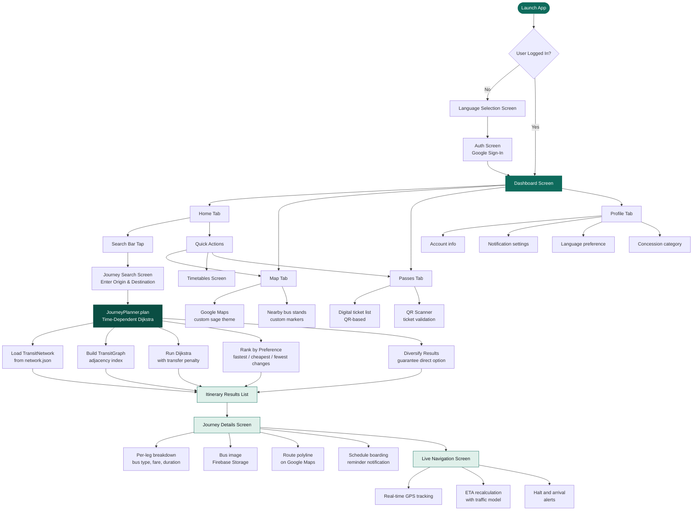
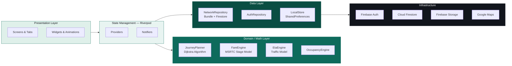
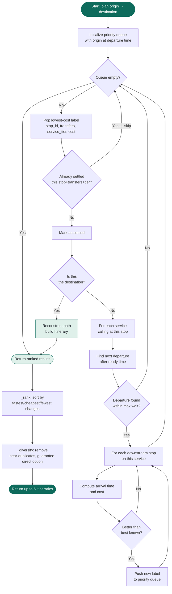

<div align="center">


<h1>BussPass — Your Travel Partner</h1>

<p><strong>Smart journey planning, real-time tracking, and digital passes for India's state road transport corporations — built to scale across every state.</strong></p>

<p>
  
  
  
  
  
  
</p>

<p>
  
  
  
  
  
</p>

</div>

---

## Table of Contents

- [Problem Statement](#problem-statement)
- [Solution Overview](#solution-overview)
- [Application Flow](#application-flow)
- [Features](#features)
- [Architecture](#architecture)
- [Project Structure](#project-structure)
- [Technology Stack](#technology-stack)
- [Data Pipeline](#data-pipeline)
- [Fare Engine](#fare-engine)
- [Journey Planner Algorithm](#journey-planner-algorithm)
- [Localization](#localization)
- [Setup and Installation](#setup-and-installation)
- [Environment Variables](#environment-variables)
- [Scripts Reference](#scripts-reference)

---

## Problem Statement

Millions of bus commuters across India face these challenges every day:

| Pain Point | Impact |
|---|---|
| No digital journey planner | Commuters must ask locals or visit the stand physically |
| Opaque fare calculation | Confusion between bus types (Ordinary vs Shivneri, etc.) |
| No offline timetable access | Rural areas with poor connectivity have zero digital support |
| Paper-only schedules | Information exists only on notice boards at bus stands |
| No multilingual support | Marathi and Hindi-speaking users cannot use English-only apps |
| Paper tickets only | No digital pass or wallet — easily lost, no history |

---

## Solution Overview

BussPass digitizes the state bus commuter experience as a mobile-first Android application:

- Search routes between any two stops across the full state transport network
- Compute the optimal journey path using a time-dependent Dijkstra algorithm — accounting for transfers, bus type, fare, and total travel time
- Display accurate official stage-based fares (MSRTC, KSRTC, GSRTC, etc.) for every leg and every bus class
- Work completely offline via a bundled `network.json` dataset pre-built from verified MSRTC timetable data
- Show a live map of nearby bus stands and active buses
- Switch between English, Marathi, Hindi, and Kannada with a single tap
- Manage digital pass purchases and QR-based ticket scanning

---

## Application Flow



---

## Features

### Journey Planning

- Multi-leg journey planning across the entire state transport network
- Transfers supported at major interchange stops (Nashik CBS, Pune Station, Mumbai Central, etc.)
- Preference-based sorting — fastest, cheapest, or fewest changes
- Guaranteed diversity in results — always shows a direct option when one exists
- All bus types shown — Ordinary, Semi Luxury, AC Seater, AC Sleeper, and state-specific brands (MSRTC Hirkani, Shivshahi, Shivneri; KSRTC Airavat; GSRTC Volvo, etc.)

### Fare Engine

- Implements the official stage-based fare model for each state (currently seeded with MSRTC 18 July 2026 rates)
- Supports all major bus classes across Indian state transport operators with per-class stage rates
- Full concession support — Child, Senior Citizen, Women, Student, Person with Disability
- Per-stop-pair fare computation — a short hop always costs proportionally less

### Offline-First Network

- Full national route graph bundled as a compact offline dataset (439 KB)
- Works without internet for route search and fare queries
- Firebase Firestore used for real-time overlays (live bus positions, timetable updates)

### Live Map

- Full-screen Google Maps with a custom dark-sage theme
- All nearby bus stands plotted as custom-rendered bitmap markers
- Accurate route polylines that follow real road corridors, not straight-line approximations

### Notifications

- Boarding reminders scheduled before departure
- Arrival alerts as the bus approaches the destination stop
- Halt stop alerts for overnight journeys

### Multilingual Support

- English, Marathi, Hindi, and Kannada supported natively
- Language can be changed at any time from the Home Screen (A/अ button)
- Selected language persisted across app restarts

### Digital Passes

- QR-code-based digital tickets
- Pass scanning and validation via mobile scanner
- Multiple pass types: daily, weekly, monthly, student

---

## Architecture



---

## Project Structure

```
SIH-BussPass/
├── busspass/                          Flutter application
│   ├── lib/
│   │   ├── core/
│   │   │   ├── math/
│   │   │   │   ├── journey_planner.dart     Time-dependent Dijkstra planner
│   │   │   │   ├── fare_engine.dart         State transport stage fare model
│   │   │   │   ├── eta_engine.dart          ETA with traffic model
│   │   │   │   ├── occupancy_engine.dart    Seat occupancy estimation
│   │   │   │   ├── geo.dart                 Haversine distance utilities
│   │   │   │   └── schedule.dart            Departure and arrival scheduling
│   │   │   ├── services/
│   │   │   │   ├── notification_service.dart
│   │   │   │   ├── transit_detection_service.dart
│   │   │   │   └── travel_pattern_alerts.dart
│   │   │   └── utils/
│   │   │       └── bus_image_helper.dart    Firebase Storage image URL map
│   │   │
│   │   ├── data/
│   │   │   ├── models/
│   │   │   │   ├── network_models.dart      NetworkStop, TransitRoute, etc.
│   │   │   │   ├── ticket.dart              Digital pass and ticket models
│   │   │   │   └── live_bus.dart            Real-time bus state
│   │   │   ├── providers/
│   │   │   │   ├── app_providers.dart       All Riverpod providers
│   │   │   │   └── auth_provider.dart
│   │   │   └── repositories/
│   │   │       ├── network_repository.dart  Merges bundle and Firestore overlay
│   │   │       ├── auth_repository.dart
│   │   │       └── local_store.dart         SharedPreferences wrapper
│   │   │
│   │   ├── features/
│   │   │   ├── onboarding/                  Language selection and Auth screens
│   │   │   ├── dashboard/                   4-tab main screen
│   │   │   ├── journey/                     Search, details, live navigation
│   │   │   └── timetable/                   Static timetable viewer
│   │   │
│   │   ├── theme/                           Design system
│   │   └── main.dart
│   │
│   └── assets/
│       ├── data/network.json                Bundled offline route graph (439 KB)
│       └── translations/                    en / mr / hi / kn JSON files
│
├── scripts/                           Data pipeline (Node.js)
│   ├── msrtc_data.js                  Master route, stop, and fare definitions
│   ├── build_dataset.js               Compiles network.json from all sources
│   ├── seed_firestore.js              Seeds Firestore with routes and fare matrices
│   └── master_timetables.json         Scraped and verified timetable rows (MSRTC)
│
├── Bus-images/                        Source bus type photographs
├── ARCHITECTURE.md                    Extended architectural notes
└── README.md
```

---

## Technology Stack

### Mobile Application

| Technology | Version | Purpose |
|---|---|---|
|  | 3.24 | Cross-platform mobile framework |
|  | 3.11 | Application language |
|  | 3.x | State management and dependency injection |
|  | 6.x | Google and Facebook sign-in |
|  | 6.x | Real-time database |
|  | — | Bus type images |
|  | 2.18 | Live map, polylines, custom markers |
| Easy Localization | 3.x | Multilingual support (en, mr, hi, kn) |
| Flutter Animate | 4.x | Micro-animations and transitions |
| Flutter Local Notifications | 22.x | Boarding and arrival alerts |
| Mobile Scanner | 7.x | QR code scanning |
| QR Flutter | 4.x | QR code generation |
| Geolocator | 14.x | Device GPS for nearest-stop lookup |

### Data Pipeline

| Technology | Purpose |
|---|---|
| Node.js 18 | Dataset compilation scripts |
| Firebase Admin SDK | Firestore and Storage seeding |
| Haversine geometry | Distance computation for stop-pair fares |

---

## Data Pipeline

```mermaid
flowchart LR
    A[scripts/msrtc_data.js\n91 Stands · 273 Routes (MSRTC — extendable to other states)\nWaypoints · Fare Model] --> C
    B[master_timetables.json\n988 Timetable Rows] --> C

    C[scripts/build_dataset.js] --> C1[Resolve via-stop\nGPS coordinates]
    C --> C2[Compute cumulative\ndistance at each stop]
    C --> C3[Synthesize headway-based\ndeparture schedules]
    C --> C4[Validate geometry\nreject implausible pairs]

    C1 & C2 & C3 & C4 --> D[busspass/assets/data/network.json\n91 stops · 273 routes · 602 services · 5494 departures · 439 KB]

    D --> E[NetworkRepository\nLoaded at app startup\nCached in memory]
    D --> F[JourneyPlanner\nDijkstra over TransitGraph]

    style A fill:#0E6B5C,color:#fff,stroke:none
    style B fill:#0E6B5C,color:#fff,stroke:none
    style C fill:#0A4E43,color:#fff,stroke:none
    style D fill:#DFF0EA,color:#11151C,stroke:#0E6B5C,font-weight:bold
    style E fill:#11151C,color:#fff,stroke:none
    style F fill:#11151C,color:#fff,stroke:none
```

**Rebuild the dataset after modifying routes:**

```bash
cd scripts
node build_dataset.js
```

**Seed Firestore with routes and fare matrices:**

```bash
cd scripts
node seed_firestore.js
```

---

## Fare Engine

The `FareEngine` class (`lib/core/math/fare_engine.dart`) implements stage-based fare models for Indian state transport corporations (MSRTC, KSRTC, GSRTC, etc.). The rate table shown here uses the MSRTC schedule (effective 18 July 2026) and can be extended per state.

**Formula:**

```
stages    = ceil(distance_km / 6)
raw_fare  = stages × stage_rate
base_fare = max(₹10, round_to_nearest_₹5(raw_fare))
final_fare = base_fare × (1 − concession_percent / 100)
```

**Stage rates:**

| Bus Class | Rate (Rs. / 6 km stage) |
|---|---|
| Ordinary (Lalpari) | 11.40 |
| Semi Luxury — Hirkani / Ashiad | 13.65 |
| Ordinary Sleeper-Seater | 15.50 |
| Ordinary Sleeper | 16.75 |
| Shivshahi AC Seater | 14.20 |
| Shivshahi AC Sleeper | 15.35 |
| Shivneri AC Seater | 21.25 |
| Shivneri AC Sleeper | 25.35 |

**Concession categories:**

| Category | Discount |
|---|---|
| Adult | 0% |
| Child (5–12 years) | 50% |
| Senior Citizen (65 and above) | 100% — free |
| Women — Mahila Samman Yojana | 50% |
| Student | 50% |
| Person with Disability | 100% — free |

---

## Journey Planner Algorithm



**Default PlannerConfig:**

| Parameter | Default |
|---|---|
| Max transfers | 2 |
| Max wait per transfer | 120 minutes |
| Min transfer time | 10 minutes |
| Transfer penalty | 40 minutes |
| Max walk distance | 1.5 km |
| Result count | 5 |

---

## Localization

The app uses `easy_localization`. Translation files are in `assets/translations/`.

| Badge | Language Code | Language |
|---|---|---|
|  | `en` | English |
|  | `mr` | Marathi |
|  | `hi` | Hindi |
|  | `kn` | Kannada |

Language is changed from the **A/अ** button on the Home Screen and persisted across restarts.

To add a new translation key:
1. Add the key-value pair to each JSON file in `busspass/assets/translations/`.
2. Reference it in Dart code as `'section.key'.tr()`.

---

## Setup and Installation

### Prerequisites

| Requirement | Version |
|---|---|
| Flutter SDK | 3.24 or higher |
| Dart SDK | 3.11 or higher |
| Android Studio or VS Code | Latest stable |
| Firebase project | Auth + Firestore + Storage enabled |
| Google Maps API key | Android Maps SDK |
| Node.js | 18 or higher (scripts only) |

### Steps

**1. Clone the repository**

```bash
git clone https://github.com/PrashilD15/BussPass-SIH.git
cd BussPass-SIH
```

**2. Install Flutter dependencies**

```bash
cd busspass
flutter pub get
```

**3. Configure Firebase**

- Create a project at https://console.firebase.google.com
- Enable Google Sign-In under Authentication
- Create a Firestore database in Native mode
- Enable Firebase Storage
- Download `google-services.json` → place at `busspass/android/app/google-services.json`
- Run `flutterfire configure` to regenerate `firebase_options.dart`

**4. Set your Google Maps API key**

In `busspass/android/app/src/main/AndroidManifest.xml`:

```xml
<meta-data
    android:name="com.google.android.geo.API_KEY"
    android:value="YOUR_API_KEY_HERE" />
```

**5. (Optional) Run the data pipeline**

```bash
cd scripts
npm install
# Place Firebase service account key at scripts/serviceAccountKey.json
node build_dataset.js
node seed_firestore.js
```

**6. Run the application**

```bash
cd busspass
flutter run
```

---

## Environment Variables

> These files must NOT be committed to version control. All are listed in `.gitignore`.

| File | Purpose |
|---|---|
| `busspass/android/app/google-services.json` | Firebase Android configuration |
| `busspass/lib/firebase_options.dart` | FlutterFire generated configuration |
| `scripts/serviceAccountKey.json` | Firebase Admin SDK service account |
| `busspass/lib/core/constants/api_keys.dart` | Google Maps API key |

---

## Scripts Reference

| Script | Command | Description |
|---|---|---|
| Build offline dataset | `node scripts/build_dataset.js` | Compiles network.json from curated data and timetables |
| Seed Firestore | `node scripts/seed_firestore.js` | Writes routes and fare matrices to Firestore |
| Verify seed | `node scripts/verify_seed.js` | Checks Firestore document counts after seeding |
| Report routes | `node scripts/report_routes.js` | Prints a summary of all loaded corridors |
| Upload bus images | `node scripts/upload_images.js` | Uploads Bus-images/ folder to Firebase Storage |

---

<div align="center">

Developed for **Smart India Hackathon (SIH) 2024-25**


</div>
