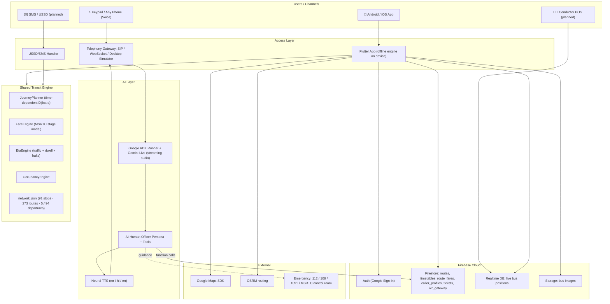
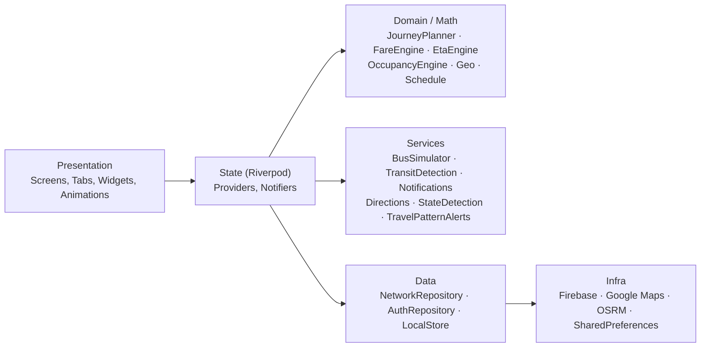
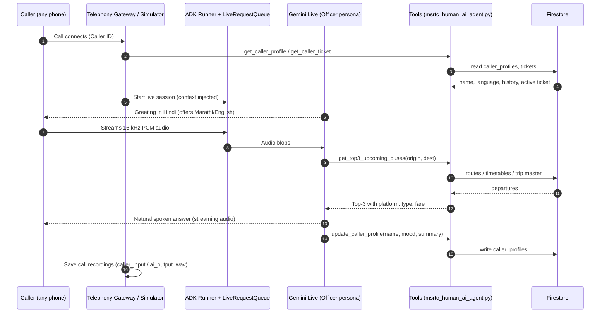
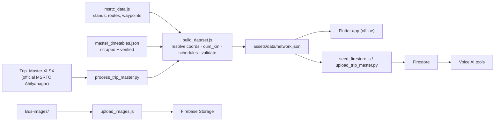

# BussPass — System Architecture

## 1. High-Level Architecture

---

## 2. Mobile App — Layered (Clean) Architecture

| Layer | Key Modules | Responsibility |
|---|---|---|
| Presentation | `features/onboarding`, `dashboard/tabs/*`, `journey/*`, `timetable`, `state` | UI, navigation (`AuthWrapper` → `DashboardScreen` with `IndexedStack` of 4 tabs) |
| State | `data/providers/app_providers.dart`, `state_provider.dart` | Reactive DI, STC switching |
| Domain | `core/math/*` | Pure, testable algorithms with no I/O |
| Services | `core/services/*` | Device and OS integrations, simulation |
| Data | `data/repositories/*`, `data/models/*` | Bundle + Firestore merge, local persistence |

### 2.1 Core Engines

| Engine | File | Model |
|---|---|---|
| Journey Planner | `journey_planner.dart` (~1,100 LOC) | Time-dependent Dijkstra over stops; labels `(stop, transfers, tier)`; max 3 transfers; 10-min min transfer; 25-min penalty; walk ≤ 1.5 km @ 4.5 km/h; rank and diversify to 4 |
| Fare Engine | `fare_engine.dart` | `stages = ⌈km/6⌉`; `fare = max(₹10, round5(stages × rate))`; concession % applied |
| ETA Engine | `eta_engine.dart` | `t = distance / v_eff + stops × 70 s + halts`; `v_eff` depends on trip length, time of day, stop density; traffic factor +8% / 0 / −18% / −35% |
| Occupancy | `occupancy_engine.dart` | POS-reported (ground truth) else modelled (peak window, weekday, distance from origin, class) |
| Bus Simulator | `bus_simulator.dart` | Deterministic position = f(service, departure, clock); hash-based delay per bus; 220 buses; 3 s tick |
| Transit Detection | `transit_detection_service.dart` | Speed ≥ 15 km/h for 2 min → within 50 m of corridor → match live bus → < 100 m for 3 min ⇒ ON BOARD |
| State Detection | `state_detection_service.dart` | Offline GPS bounding-box → STC + brand palette |

---

## 3. AI Human Voice IVR Architecture

### 3.1 AI Tools

| Tool | Purpose | Data Source |
|---|---|---|
| `get_caller_profile` / `update_caller_profile` | CRM memory: name, language, mood, frequent routes | Firestore `caller_profiles` |
| `get_top3_upcoming_buses` | 3 closest departures from the current time, with fuzzy city matching | `routes`, `timetables`, Trip Master |
| `get_route_details` | Via-stops, duration, bus types | `routes` |
| `get_fare_details` | Fare by bus type (MSRTC stage formula) | Computed |
| `get_live_bus_eta` | Live location and ETA for a bus number | Live feed |
| `get_caller_ticket` | Active ticket by phone number | `tickets` |
| `handle_emergency` | Accident / Unsafe / Medical / Breakdown / Fire / Missing → priority, empathy line, contacts, guidance | Rule table |

### 3.2 Deployment Options
1. **Cloud server** (Docker / Cloud Run) exposing WebSockets for WebRTC and mobile audio.
2. **SIP/VoIP gateway** (Exotel / Twilio / Asterisk) whose webhook streams PSTN calls to the AI server.
3. **Desktop simulator** (`ivr_simulator_gui.py`, Tkinter) with dial pad, DTMF, live mic, and recordings.
4. **IoT trigger**: a hardware device sets `ivr_gateway/current_call.status = "ringing"`; the simulator auto-answers.

---

## 4. Data Pipeline

---

## 5. Data Model (Firestore)

| Collection | Key Fields |
|---|---|
| `bus_stops` | id, name, city, lat, lng |
| `routes` | id, bus type, total distance, `stops[] {stop_id, name, city, lat, lng, seq, cum_km}` |
| `route_fares` | `by_type`, `segments{"from__to": {distance_km, by_type}}` |
| `timetables` / trip master | route, departure times, platform, bus type |
| `route_cache` | pre-computed O-D results (distributed memoization) |
| `tickets` | id, phone, route, legs, status (upcoming / active / completed / cancelled / expired), QR payload |
| `caller_profiles` | phone, name, preferred language, mood, call history, frequent routes |
| `ivr_gateway/current_call` | status (ringing / answered), phone |
| RTDB `live_buses/{busId}` | lat, lng, speed, heading, next stop, timestamp |

---

## 6. Security & Privacy Architecture
- Firebase Auth for identity; Firestore security rules scoped per collection.
- Secrets (`serviceAccountKey.json`, `google-services.json`, `.env`) are git-ignored. API keys must be loaded from environment variables or a secret manager, never hardcoded.
- Rider GPS for transit detection stays **in memory on device**.
- Caller data limited to what's needed for service (CRM fields); planned 24-hour purge for location data and DPDP Act 2023 alignment.
- Emergency responses are rule-based (deterministic), not left to free-form generation.

---

## 7. Scalability Roadmap

| Metric | Prototype | Production |
|---|---|---|
| Buses tracked | 220 simulated | 50,000+ real (AIS-140 VLTS) |
| Concurrent users | ~100 | 10M+ |
| RTDB | single instance | sharded by state/region |
| Planner | on-device in-memory | on-device + `route_cache` / Redis |
| IVR | desktop / sandbox | multi-region SIP + autoscaled AI workers |
| GPS interval | fixed | adaptive (5 s city / 30 s highway) |
