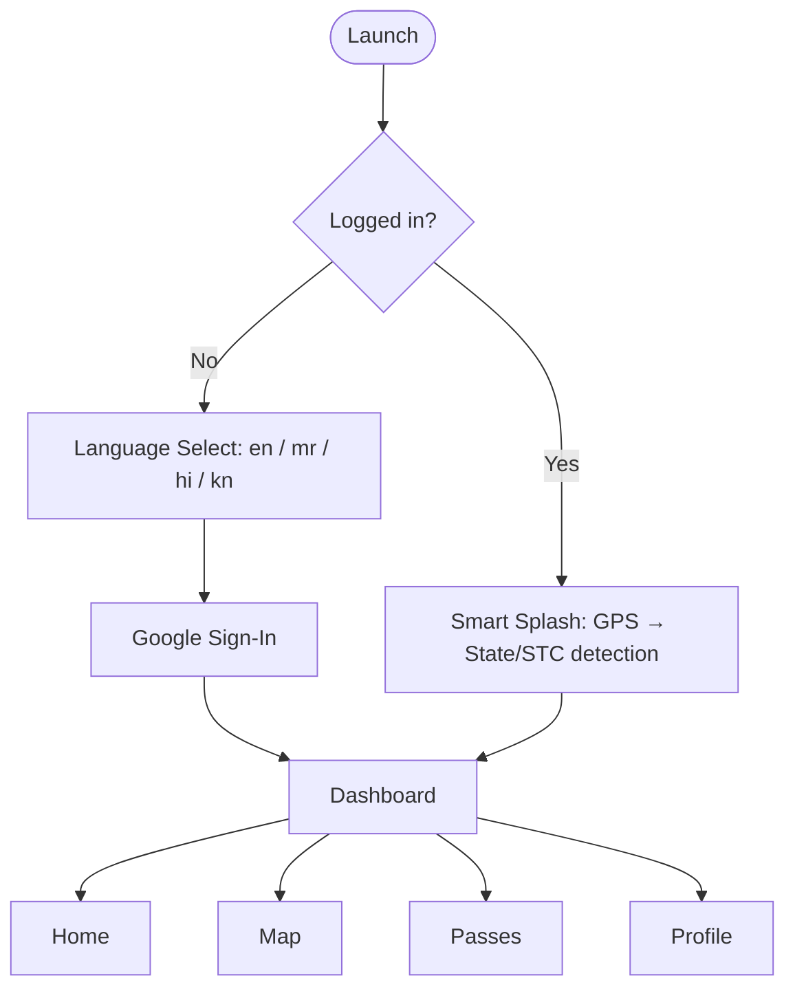
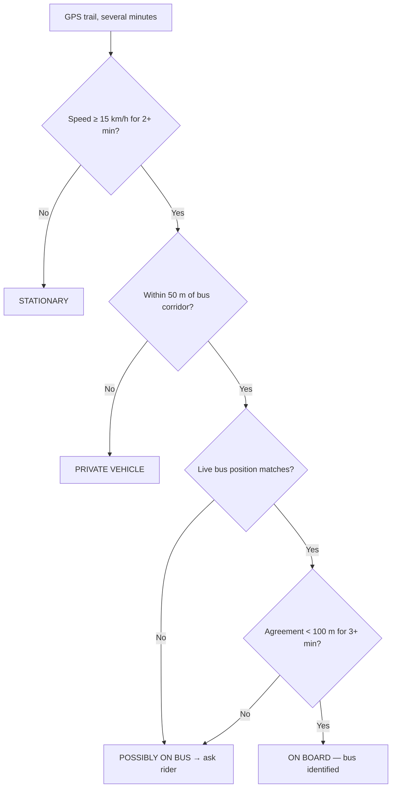
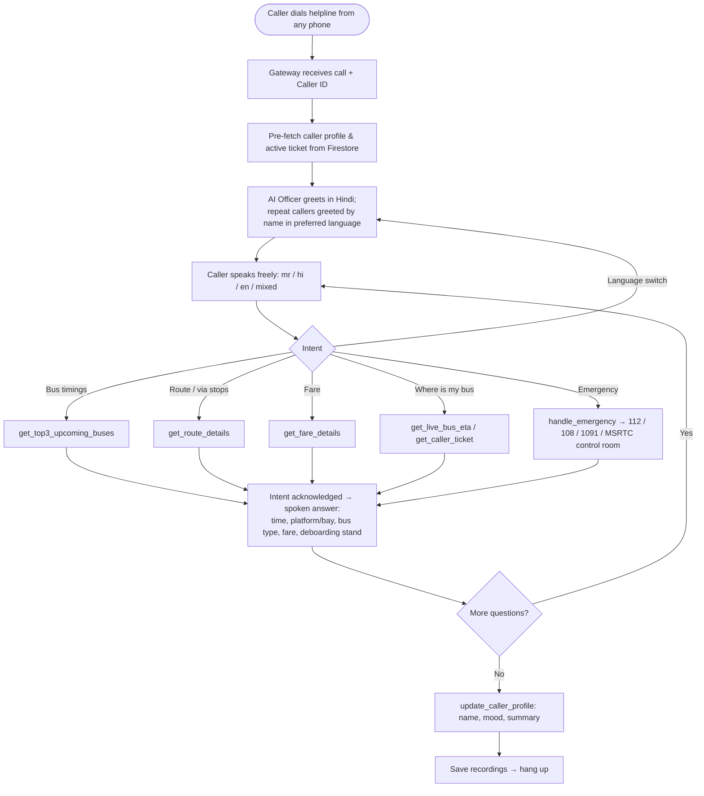
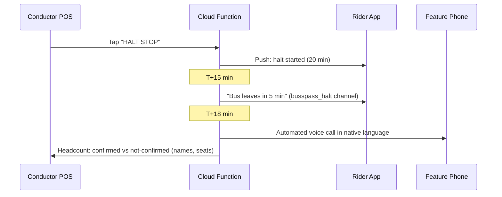
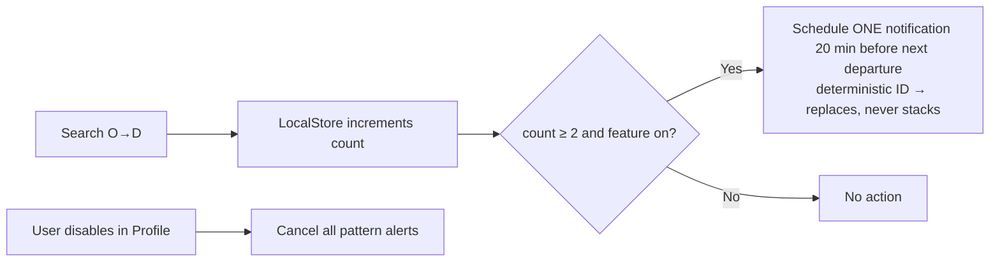
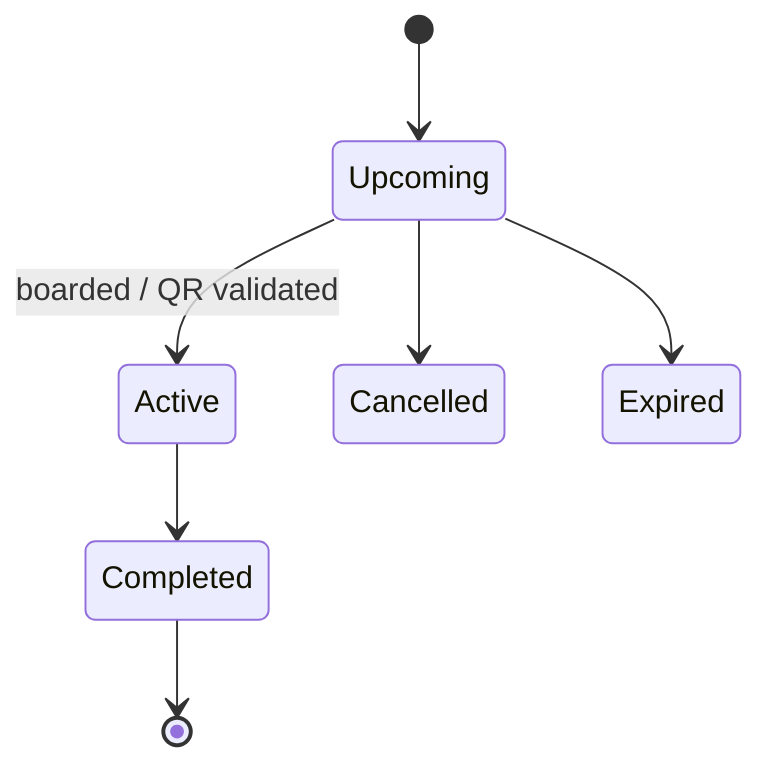

# BussPass — Workflows

## 1. App Onboarding & Launch



## 2. Journey Planning → Travel

```mermaid
flowchart TD
    A[Home: 'Where to?'] --> B[Search: origin, destination, time]
    B --> C[Load offline network.json → TransitGraph]
    C --> D[Time-dependent Dijkstra\n≤3 transfers · 10 min min-transfer · 25 min penalty]
    D --> E[Rank: fastest / cheapest / fewest changes]
    E --> F[Diversify → up to 4 itineraries, direct guaranteed]
    F --> G[Journey Details\nlegs, fare, ETA, occupancy, bus photo, polyline]
    G --> H{User > 100 m from stand?}
    H -->|Yes| W[Walk-to-Stand nav (OSRM walking)]
    H -->|No| L
    W --> L[Live Navigation\nGPS · ETA recalc · arrival & halt alerts]
    L --> T[Transit Detection confirms on-board bus]
    T --> Z([Arrive → ticket marked completed])
```

## 3. Transit Detection Decision Tree



## 4. AI Human Voice IVR Call Flow



**Example exchange (Marathi):**
> **Caller:** "संगमनेरहून नाशिकला बस कधी आहे?"
> **AI:** "नमस्कार! मला समजले, तुम्हाला संगमनेर ते नाशिक प्रवासाबद्दल माहिती हवी आहे. पुढच्या तीन बस आहेत — १२:४० शिवशाही, प्लॅटफॉर्म ३…"

## 5. Night-Halt Safety Alert (planned conductor flow + built rider alerts)



## 6. Travel-Pattern Alerts



## 7. Ticket Lifecycle



## 8. Data Pipeline Workflow
1. Update the sources (`msrtc_data.js`, `master_timetables.json`, official Trip Master XLSX).
2. `python scripts/process_trip_master.py` merges official trips into `network.json`.
3. `node scripts/build_dataset.js` resolves coordinates, computes `cum_km`, synthesizes schedules, and validates geometry.
4. `node scripts/seed_firestore.js` (+ `upload_trip_master.py`) loads routes, fares, and timetables into Firestore.
5. `node scripts/verify_seed.js` checks counts. `upload_images.js` pushes bus photos.
6. The app ships the new bundle; Firestore overlays live updates without an app release.

## 9. Development Workflow
- Flutter: `flutter pub get` → `flutter run` (Android/iOS).
- IVR: activate `ivr_venv` → set `GEMINI_API_KEY` in env → `python ivr_simulator_gui.py` (or `adk_live_voice.py` for headless mic mode).
- Git: feature commits (`feat:`, `fix:`, `design:`, `docs:`); secrets stay out of the repo.
